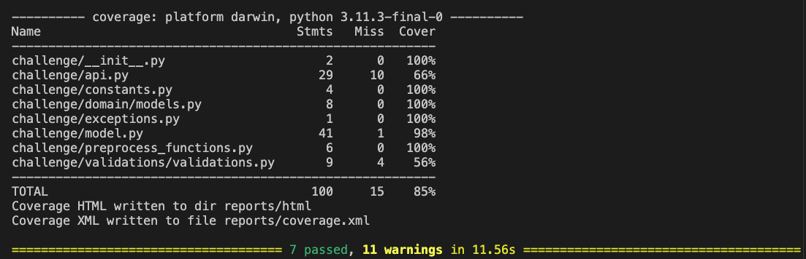
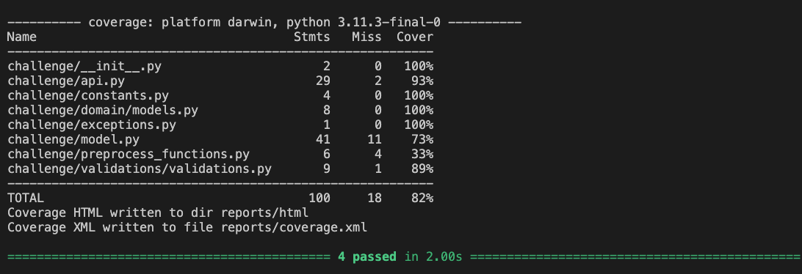
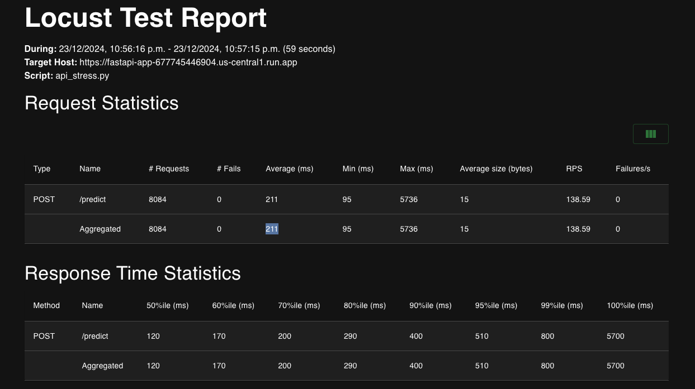
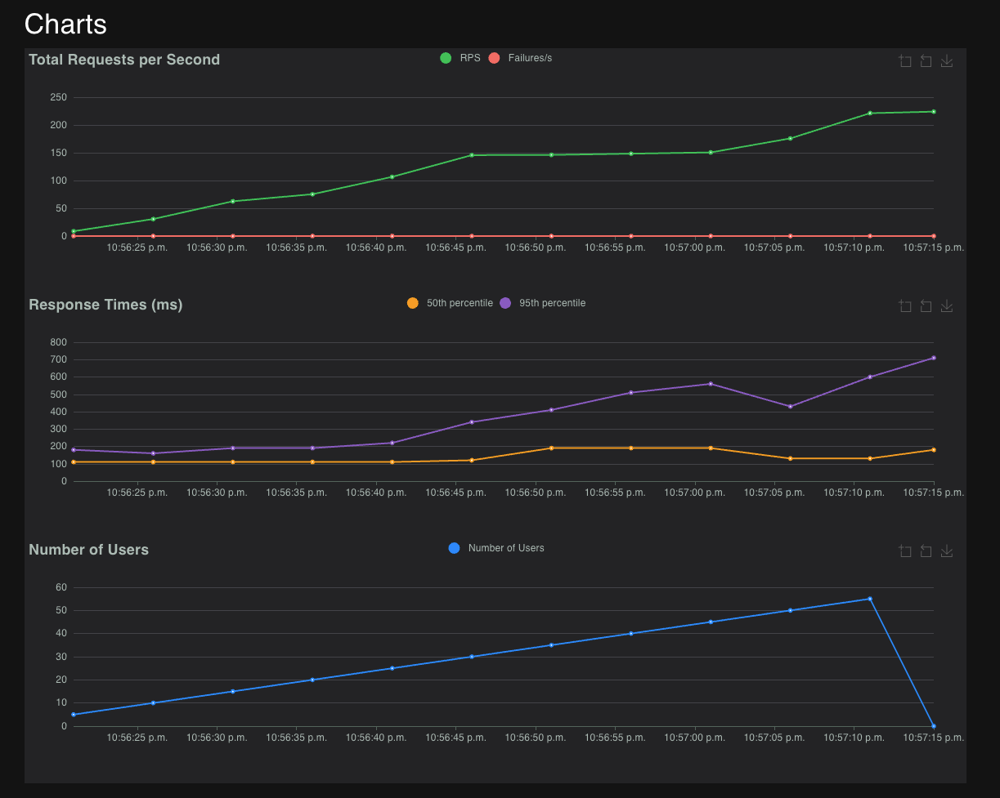
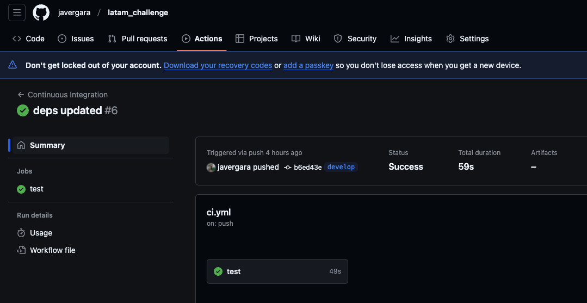
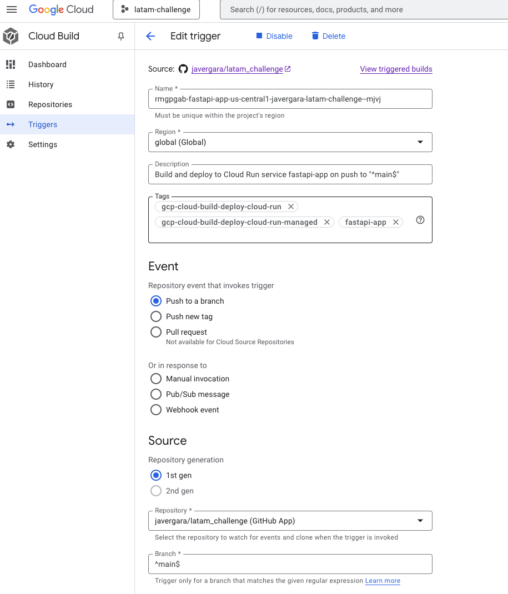
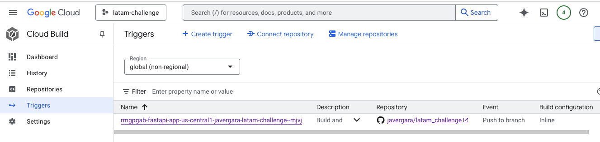
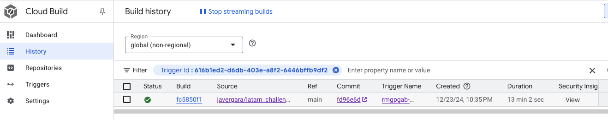

# Machine Learning Engineer Challenge Documentation

## Part 1: Transcribe the .ipynb Code to model.py

### Overview

In this section, we will transcribe the code from a Jupyter Notebook (`.ipynb`) to a Python script (`model.py`). This process involves converting the notebook cells into a cohesive and well-structured Python script, to preprocess data, train a model and predict.

### Steps

1. **Model selection**
    As it is said in the notebook "the model to be productive must be the one that is trained with the top 10 features and class balancing", so let's go deeper into how to select a model and why I selected the **Logistic regression**. Points to have in mind to select a mode:

     - Performance: There is no significant difference in performance between XGBoost and Logistic Regression.
     - Efficiency: With the feature selection (TOP 10) and class balancing, it is being improved in both.
     - Interpretability: Logistic Regression is easier to interpret and explain, especially when using the top 10 most important features.
     - Simplicity: Logistic Regression It is computationally less complex compared to XGBoost, which reduces the computational cost and makes it easier to maintain in production.

    So the decition is Logistic regression as it is less complex and easier to interpret.

2. **Modify the Model module**

   - Add `constants.py` and `preprocess_functions.py` to manage things out of the scope of the class DelayModel.
   - Modify **preprocess** method to return a tuple of features,target or just a dataframe with the features, the features are always returned with the TOP 10 feture selection.
   - Modify **fit** method to train the model using the features and the target but having in mind the class balance and stores it in the instance variable `self._model`
   - Modify **predict** method to use `self._model` and predict using the parameter features, raises an error if the model has not been trained

3. **Tests**

   - Modify **Data Loading** path to be a relative path to the project
   - Modify **test_model_predict** test to train a model first and then use it, as it was before, the test is always failing as the model needs to be trained first. Despite the model was trained in the previous test, remember that each tests is independent and the setup method will always clear and instantiate again all for each test.
   - Add **test_model_predict_error** test to increase the coverage and test the error case when the model is not trained before

**Evidence of running the make model-test**


## Part 2: Deploy the model in an API with FastAPI using the api.py file.

### Description:

The model with the TOP 10 features and balanced was deployed on the FastAPI App, all test cases passed, some considerations:

- The DelayModel class was modified adding two methods to export model and load model
- When using the export model method this will create a new model with a timestamp (for versioning the model) and replace the `model_latest.joblib`
- The api will always use the `model/model_latest.joblib` model to do a predictions

Example of how to do a prediction with the api:

```bash
curl -X 'POST' 'http://127.0.0.1:8000/predict' -H 'accept: application/json' -H 'Content-Type: application/json' -d '{"flights": [{"OPERA": "Grupo LATAM","TIPOVUELO": "I" "MES": 11}]}'
```

**Evidence of running the make api-test**
!


> **Note:**
> As future improvement, model versioning and data versioning can be added, the model versioning implemented using the timestamp is not a good idea in a real environment


## Part 3: Deploy the API in your favorite cloud provider

For this part, a Dockerfile was created in order to deploy the app in any service, for this case GCP was choosen and the api was deployed using Google Cloud Run, connected directly to the GitHub repository (CD will be explained in part 4) which build and deploy the DockerFile

The URL to do the requests is:

`https://fastapi-app-677745446904.us-central1.run.app`

and example of how to get a prediction to the server:

```bash
curl -X 'POST' \
  'https://fastapi-app-677745446904.us-central1.run.app/predict' \
  -H 'accept: application/json' \
  -H 'Content-Type: application/json' \
  -d '{
  "flights": [
    {
      "OPERA": "Grupo LATAM",
      "TIPOVUELO": "I",
      "MES": 11
    }
  ]
}'
```

### Result of the stres test:

After running the `make stress-test` some results are:\

**Statistics**


**Charts**


**Final ratio**

Ratio Per Class
- 100.0% StressUser
   - 50.0% predictArgentinas
   - 50.0% predictLatam
Total Ratio
- 100.0% StressUser
   - 50.0% predictArgentinas
   - 50.0% predictLatam

## Part 4: proper CI/CD implementation for this development.

Let's divide in two,

### CI

The CI is inside `.github/workflows/ci.yml`, it runs when there is a push on main or develop

**Evidences of running the CI:**

[github workflow](https://github.com/javergara/latam_challenge/actions) here you can find the workflows executions



### CD

The CD is not on `.github/workflows/cd.yml` because it is already integrated to the `cloud run service` , and it is triggered when main branch is pushed

**Configuration:**



**Evidence of CD runs**




